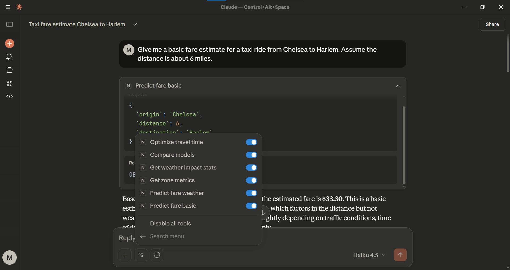

# NYC Taxi Smart Agent (Big Data & AI Pipeline)

This project implements a scalable data pipeline using **Apache Spark** to analyze NYC Taxi data, integrates **NOAA Weather data** to improve fare prediction accuracy, and exposes these insights via a **GenAI Agent - Claude Desktop (MCP Server)**.

## 📂 Project Structure
```text
.
├── data/
│   ├── 2023_Green_Taxi_Trip_Data.csv  # Raw Taxi Data (Download required)
│   ├── NYC-Weather-NOAA-2023.csv      # Secondary Source
│   ├── taxi_zone_lookup.csv           # Location Metadata
│   ├── integrated_data.csv            # Final joined dataset (Generated)
│   ├── analytics_summary.csv          # Urban Planning insights (Generated)
│   ├── Green_Taxi_Trip_Data_Data_Dictionary.csv           # Data Dictionary
│   ├── part_a_cleaned_taxi.csv            # Part A - Spark Data Pipeline Transformations
│   └── part_a_analytics.csv          # Part A - Advanced Analytics
├── src/
│   ├── spark/
│   │   ├── 01_data_pipeline.py        # Part A: Data Eng & Analytics
│   │   ├── 02_model_training.py       # Part A: MLlib Modeling (Taxi Only)
│   │   ├── 03_weather_analytics.py    # Part B: Weather Integration & Insights
│   │   └── 04_weather_modeling.py     # Part B: Advanced Modeling (Taxi + Weather)
│   └── mcp/
│       └── server.py                  # Part C: AI Agent Server with 6 Tools
├── README.md
└── requirements.txt
```

## **🚀 Setup & Execution**

### **1\. Prerequisites**

* **Python 3.9+** (Tested on Python 3.13)  
* **Java 11 (OpenJDK)**  
  * *Required for Apache Spark.*  
  * Verify with: `java -version`  
* **Claude Desktop App** (For the AI Agent interface)

### **2\. Installation**

```Bash  
pip install \-r requirements.txt
```
### **3\. Running the Data Pipeline**

Run the scripts in order to process data and train models.

**Part A: Core Pipeline & Baselines**

```Bash  
# 1. Clean data, run benchmarks, and generate Part A analytics  
python src/spark/01_data_pipeline.py

# 2. Train baseline models (Linear Regression, GBT, RF) on Taxi data only  
python src/spark/02_model_training.py
```
**Part B: Weather Integration**

```Bash  
# 3. Join with NOAA Weather data and generate insights  
python src/spark/03_weather_analytics.py

# 4. Train Advanced Weather-Aware Random Forest  
python src/spark/04_weather_modeling.py
```
### **4. Running the AI Agent (MCP)**

To interact with the analysis using natural language, configure the Claude Desktop App.

**Configuration File Location:**

* Windows: `%APPDATA%\Claude\claude_desktop_config.json`  
* Mac/Linux: `~/Library/Application Support/Claude/claude_desktop_config.json`

**Configuration Content:** Update the `command` path to your specific Python executable (run `where python` to find it).
```Bash
JSON  
{  
  "mcpServers": {  
    "nyc-taxi": {  
      "command": "C:\\\\Path\\\\To\\\\Your\\\\Python\\\\python.exe",  
      "args": \[  
        "C:\\\\Users\\\\YOUR\_USER\\\\Path\\\\To\\\\Project\\\\src\\\\mcp\\\\server.py"  
      \]  
    }  
  }  
}
```
*(Note: Use double backslashes `\\` for Windows paths in JSON).*

**Restart Claude Desktop** after saving the file. Look for the 🔌 icon to confirm the server is active.

## **🤖 AI Capabilities**

The Agent provides 6 tools for intelligent analysis:

1. **`predict_fare_basic`**: Quick estimate using GBT (No weather).  
2. **`predict_fare_weather`**: Advanced estimate using RF (With weather).  
3. **`get_zone_metrics`**: Traffic volume & congestion data for Urban Planners.  
4. **`get_weather_impacts`**: Statistical insights on rain/snow impact.  
5. **`compare_models`**: Shows the "Rain Tax" by running both models.  
6. **`optimize_travel_time`**: Finds cheapest time of day to travel.

**Error Handling & Input Validation:** All tools implement `try/except` blocks along with input validation. If a Zone ID cannot be resolved or a Model is not loaded, the agent returns a descriptive error message (e.g., *"Tool Error: Model not loaded"*) instead of crashing the server.


### Screenshots of Tools on Claude


## **📊 Methodology & Analysis**

### **1\. Data Selection (Part B)**

To enhance the fare prediction model, we integrated a secondary dataset.

* **Primary Source:** NYC Green Taxi Trip Records (2023).  
* **Secondary Source:** NOAA Daily Weather Data (JFK, Central Park, LGA).  
* **Justification:** Taxi demand and traffic conditions are heavily influenced by weather. Rain causes congestion (increasing duration/cost) and temperature affects demand.  
* **Acquisition:** Downloaded from NOAA Climate Data Online (CDO) and joined with taxi data using DATE keys.

  ### **2\. Performance Comparison (Part A)**

We benchmarked the aggregation of 700k+ rows (Average Fare by Borough) using both Spark and Pandas.

* **Spark Execution:** \~2.76 seconds  
* **Pandas Execution:** \~1.78 seconds  
* **Observation:** Pandas is faster for this specific dataset size (\<1GB) due to lower overhead. However, the Spark pipeline is architected to scale horizontally for terabyte-scale data where Pandas would fail with MemoryError.

  ### **3\. Model Improvement**

Integrating weather features improved the model's explanatory power:

* **Baseline (Taxi Only):** $R^2 \\approx 0.47$  
* **Enhanced (Taxi \+ Weather):** $R^2 \\approx 0.51$  
* **Result:** Including precipitation and temperature data successfully reduced prediction error (RMSE) by accounting for weather-induced variance.